<!-- *** -->

# Introduction to Open Data Science - Course Project


## About the p**R**oject 

**Greetings**, this is my page for the course "*Introduction to open data science, 5 ECTS*". I found this course by a strong recommendation from my friend. I have 2 years of experience with `R`, but now want to take it to the next level with `Git`. I'm thrilled to learn proper version control and use of Github which promotes sharing/publishing code and perhaps networking with other R coders. Alongside these hopes, I anticipate loads of fun from this course! 

Lastly, check out my [GitHub repository](https://github.com/petrusk4/IODS-project). 

Let's enjoy this interesting course!

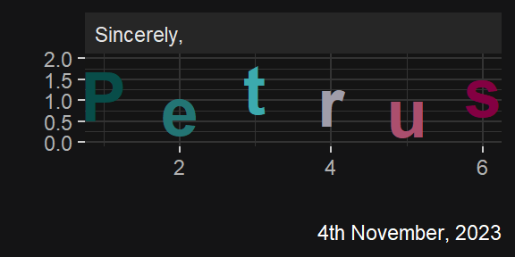


# 1 Start me up!

### `R` for Health Data Science book

[This book](https://argoshare.is.ed.ac.uk/healthyr_book/) is a blast to read on the couch from iPad. 

### The Exercise Set 1

I completed the chapters 1--5 and was familiar with the substance, but there were some nifty functions that I'll probably try out soon.


# 2 Regression and model validation

This part describes the statistical analysis of `learning2014` dataset.

> ### Instructions
> Describe the work you have done this week and summarize your learning.
>
> - Describe your work and results clearly. 
> - Assume the reader has an introductory course level understanding of writing and reading R code as well as statistical methods.
> - Assume the reader has no previous knowledge of your data or the more advanced methods you are using.

## Setup

First let's load our packages and some custom functions.


```r
# Packages
pacman::p_load(tidyverse, GGally, patchwork, ggfortify)

## Defining some custom functions
# Colors
colorpair <- c("orangered", "dodgerblue")
color_gender <- \ () {scale_color_manual(values = colorpair)}
fill_gender <- \ () {scale_fill_manual(values = colorpair)}

# Dark mode theme
theme_darkmode <- \ (backg = "#141415") {
  ggdark::dark_theme_gray() %+replace% 
    ggplot2::theme(
      plot.background = element_rect(color = backg, fill = backg),
      legend.box.background = element_rect(fill = backg, color = backg),
      legend.background = element_rect(fill = backg, color = backg),
      panel.grid = element_line(color = "gray20")
    )
}

# Beautiful labels
labs <- tribble(
  ~var, ~lab,
  "age", "Age",
  "attitude", "Attitude",
  "points", "Exam points",
  "deep", "Deep learning",
  "stra", "Strategic learning",
  "surf", "Surface learning"
)
```


## 2.1 Get and explore data

> ### Instructions
> Read the students2014 data into R --.
> Explore the structure and the dimensions of the data and describe the dataset briefly, assuming the reader has no previous knowledge of it. 

Let's read in the `learning2014` dataset and check that it is read correctly.


```r
# Read data
datasets <- list.files("data/learning/", full.names = T)
newest <- datasets %>% sub('.*_', '', .) %>% as.Date() %>% max()
data <- datasets[grepl(newest, datasets)] %>%
  readr::read_csv(show_col_types = F)

# Glance at the data
# data %>% head() %>% knitr::kable()
str(data, give.attr = F)
```

```
## spc_tbl_ [166 × 7] (S3: spec_tbl_df/tbl_df/tbl/data.frame)
##  $ gender  : chr [1:166] "F" "M" "F" "M" ...
##  $ age     : num [1:166] 53 55 49 53 49 38 50 37 37 42 ...
##  $ attitude: num [1:166] 3.7 3.1 2.5 3.5 3.7 3.8 3.5 2.9 3.8 2.1 ...
##  $ deep    : num [1:166] 3.58 2.92 3.5 3.5 3.67 ...
##  $ stra    : num [1:166] 3.38 2.75 3.62 3.12 3.62 ...
##  $ surf    : num [1:166] 2.58 3.17 2.25 2.25 2.83 ...
##  $ points  : num [1:166] 25 12 24 10 22 21 21 31 24 26 ...
```

```r
# Plot data missingness
naniar::vis_miss(data) + theme_darkmode() + ggtitle("Missingness map")
```

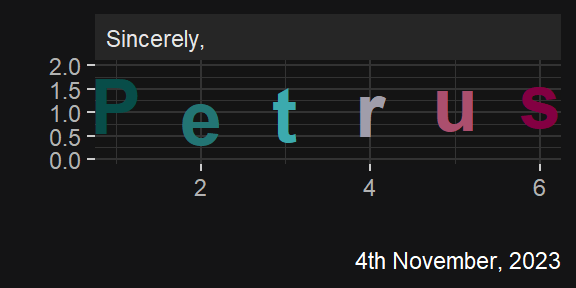

There are a total of **166 observations** and **7 variables**. We are dealing with **complete data** with no missing values. The variables can be divided to the types below (click here for more comprehensive [metadata](http://www.helsinki.fi/~kvehkala/JYTmooc/JYTOPKYS3-meta.txt)).

#### Population characteristics

- `age`: Age of the participant (in years) derived from the date of birth.
- `gender`: Here gender is coded as a nominal variable with two defined/prevalent values (F = Female, M = Male).


#### Survey answers

Clearly, the four variables `attitude`, `deep`, `stra`, and `surf` represent survey answers on a likert scale (1--5). `attitude` captures student's global attitude towards statistics. The rest of the variables were computed as averages of various interrelated questions and describe the traits below and also described in detail e.g., [here](https://spark.scu.edu.au/kb/tl/teach/focus-on-learning/deep-surface-and-strategic-learning). These traits are important as they may influence success in students' work, reflected by exam `points`.

- `surf`: *Surface learning*; emphasis upon memorising details to complete the assignment. Learning may be more superficial.
- `deep`: *Deep learning*; looking for the overall meaning and attempting to process information in a holistic way.
- `stra`: *Strategic learning*; organizing one's learning with the objective of achieving a positive outcome. Can involve a combination of both deep and surface learning strategies.


#### Exam results

- `points`: Results of the statistics exam. I did not find the maximum possible value from the metadata. Before the analysis, students that did not attend the exam (points == 0) were excluded from the dataset.

To note, these data lack subject identifier (ID) variable. However, it may not be needed as we do not have repeated measures. 


## 2.2 Graphical overwiew

> ### Instructions
> Show a graphical overview of the data and show summaries of the variables in the data. Describe and interpret the outputs, commenting on the distributions of the variables and the relationships between them. (0-3 points)

Let's visualize the distributions of our dataset with `ggplot2`.


```r
p <- data %>% pivot_longer(
  cols = colnames(data)[-1],
  values_to = "value",
  names_to = "var"
) %>%
  left_join(labs) %>%
  ggplot(aes(x = value, color = lab, fill = lab, y = lab, linetype = gender))
p <- p + ggridges::geom_density_ridges(
  aes(point_shape = gender),
  rel_min_height = .001, quantile_lines = T, quantiles = .5,
  jittered_points = TRUE, position = "raincloud",
  point_alpha = .5, point_size = 2, alpha = .3
)
p <- p + scale_shape_manual(values = c(0, 2))

breakx <- c(1, 5, seq(10, 60, by = 10))
p <- p + scale_x_sqrt(breaks = breakx, labels = breakx)
p <- p + labs(
  title = "Distributions by gender",
  subtitle = "(On a square root x-axis)"
) + xlab("Value") + ylab("")
p
```


**Likert-scale variables** are quite evenly spread on the range of 1--5. It appears that these students are `deep` learners more so than surface learners (`surf`). By visual inspection, men have more positive `attitude` towards statistics than women. Students tend to be of quite **young** `age` although a few older students skew the distribution heavily to the right. It also seems like men may be slightly older than female students. Whether these differences are statistically significant would require further testing...


### Numerical summaries

Let's summarize the numerical variables. 


```r
# Summaries for numeric variables
do.call(cbind, lapply(data, summary)) %>%
  data.frame() %>% select(-gender) %>%
  mutate(across(1:6, \ (x) as.numeric(x))) %>%
  mutate(across(1:6, \ (x) round(x, 1))) %>%
  t() %>% knitr::kable() # DT::datatable()
```


|         | Min.| 1st Qu.| Median| Mean| 3rd Qu.| Max.|
|:--------|----:|-------:|------:|----:|-------:|----:|
|age      | 17.0|    21.0|   22.0| 25.5|    27.0| 55.0|
|attitude |  1.4|     2.6|    3.2|  3.1|     3.7|  5.0|
|deep     |  1.6|     3.3|    3.7|  3.7|     4.1|  4.9|
|stra     |  1.2|     2.6|    3.2|  3.1|     3.6|  5.0|
|surf     |  1.6|     2.4|    2.8|  2.8|     3.2|  4.3|
|points   |  7.0|    19.0|   23.0| 22.7|    27.8| 33.0|

Let's also see the distribution of `gender`. It appears that most students (66%) are female. On average, male students are 1.9 years older than female students. Later we'll probably also see whether `gender` modifies the relationship between `attitude`/learning and exam `points`.


```r
data %>% group_by(gender) %>%
  summarise(
    n = sum(!is.na(gender)),
    age_mean_sd = paste0(round(mean(age), 1), " (", round(sd(age), 1), ")")
  ) %>%
  mutate(pct = scales::percent(n / sum(n))) %>%
  select(gender, n, pct, everything()) %>%
  knitr::kable()
```


|gender |   n|pct |age_mean_sd |
|:------|---:|:---|:-----------|
|F      | 110|66% |24.9 (7.4)  |
|M      |  56|34% |26.8 (8.4)  |


### Predictors of exam `points`

It is plausibile that students' `attitude` or learning strategies influence exam `points`. Therefore, let's glance over these potential relationships:


```r
p <- data %>% pivot_longer(
  cols = c(attitude, deep, stra, surf),
  values_to = "answer",
  names_to = "var"
) %>%
  left_join(labs) %>%
  ggplot(aes(x = answer, y = points, color = lab))
```

```
## Joining with `by = join_by(var)`
```

```r
p <- p + geom_point(alpha = .5, size = .5)
p <- p + geom_smooth(method = "lm", se = F)
p <- p + coord_cartesian(xlim = c(1, 5))
p <- p + labs(title = "Predictors for good or bad exam success") +
  xlab("Average answer for the set of questions") + ylab("Exam points")
p
```

```
## `geom_smooth()` using formula = 'y ~ x'
```

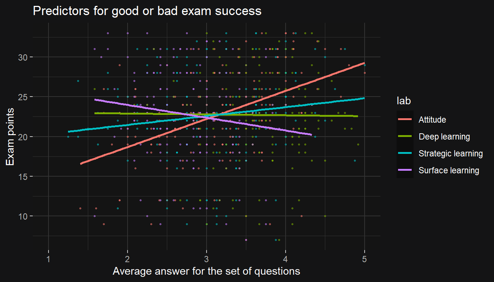

Intuitively and as hypothesized, `attitude` shows positive relationship with exam `points`, whereas `surf`ace learning may be negatively associated with `points`. The first does not however imply that attitude is *causal* for success, as there could be a confounder (e.g., competence) that associates with attitude and *causes* good exam points. The link between surface learning and poor exam points is surprising, as surface learning is focused precisely around the exam. However, whether these associations are statistically significant requires testing!


### Gender differences

It could be hypothesized that attitude, learning strategies and/or exam points differ between the `gender`s. Let's also do some preliminary hypothesis testing using Wilcoxon signed-ranks test that requires minimal assumptions.


```r
# Gender bar plot
plotdata <- data %>%
  group_by(gender) %>%
  reframe(n = n()) %>%
  mutate(
    pct = scales::percent(n / sum(n))
  )
# Calculate 95% CIs
for (i in 1:nrow(plotdata)) {
  plotdata$Lower[i] <- Hmisc::binconf(
    x = plotdata$n[i], n = sum(plotdata$n)
  )[[2]] * sum(plotdata$n)
  plotdata$Upper[i] <- Hmisc::binconf(
    x = plotdata$n[i], n = sum(plotdata$n)
  )[[3]] * sum(plotdata$n)
}
# Plot
p <- plotdata %>%
  ggplot(aes(x = gender, y = n, fill = gender))
p <- p + geom_col(width = .5)
p <- p + geom_errorbar(width = .2, aes(ymin = Lower, ymax = Upper))
p <- p + geom_text(aes(y = Upper, label = paste0(pct, "\n")))
p <- p + fill_gender()
p <- p + scale_y_continuous(expand = expansion(mult = c(0, .1)))
p <- p + labs(title = "Gender", subtitle = "95% CI")
p1 <- p

# Facetted sina plots
p <- data %>% pivot_longer(
  cols = colnames(data)[-1],
  values_to = "value",
  names_to = "var"
) %>%
  left_join(labs) %>%
  ggplot(aes(y = value, x = gender, color = gender))
p <- p + geom_violin(fill = "white", color = NA, alpha = .1)
p <- p + ggforce::geom_sina(size = .5)
p <- p + geom_boxplot(width = .2, color = "white", outlier.color = NA, alpha = .5)
p <- p + stat_summary(fun = mean, shape = 4, color = "white")
p <- p + facet_wrap(. ~ lab, scales = "free")
p <- p + color_gender()
p <- p + labs(
  title = "Potential gender differences",
  subtitle = "Wilcoxon signed-ranks test"
)
p <- p + ggpubr::stat_compare_means(
  method = "wilcox.test", size = 3,
  label = "p.format", hjust = .5, aes(x = 1.5)
)
p <- p + scale_y_continuous(expand = expansion(mult = c(0, .15)))
p2 <- p

ggpubr::ggarrange(p1, p2, legend = "none", widths = c(.3, 1), labels = "AUTO")
```


As observed from the plots, male students are the minority on the course and they are significantly older than female students. Men have significantly more positive attitude on statistics. Strategic learning does not differ between genders despite quite small $p$ value.


### Influence of gender (interactions)

Perhaps `gender` modifies the relationship between learning strategies and exam points -- let's entertain this idea (without making regression models with interactions yet). 


```r
# Define independent variables
traits <- tribble(
  ~var, ~lab, ~unit, ~zoomx,
  "age", "age", "Years", c(10, 60),
  "attitude", "attitude", "Averaged answer", c(1, 5),
  "deep", "deep learning", "Averaged answer", c(1, 5),
  "stra", "strategic learning", "Averaged answer", c(1, 5),
  "surf", "surface learning", "Averaged answer", c(1, 5)
)

# Plot in a loop
plist <- lapply(1:nrow(traits), function (i) {
  p <- data %>%
    ggplot(aes(x = .data[[traits$var[i]]], y = points, col = gender, fill = gender))
  p <- p + geom_point(size = .5, alpha = .5)
  p <- p + geom_smooth(method = "lm")
  p <- p + ggtitle(paste0("Student's ", traits$lab[[i]], "\nversus exam points"))
  p <- p + coord_cartesian(xlim = traits$zoomx[[i]])
  p <- p + xlab(traits$unit[[i]]) + ylab("Exam points")
  p <- p + color_gender() + fill_gender()
  p
})
# Combine plots into a panel
plist[[1]] + plist[[2]] + plist[[3]] + plist[[4]] + plist[[5]] +
  plot_layout(guides = "collect")
```


The slopes for men and women seem quite similar. If anything, aging might hinder men's exam success, whereas women do not experience age-related decline in exam points.


Lets make a "monster plot" of all the relationships within the data.


```r
# Visualize
# pairs(data[-1])
data %>% GGally::ggpairs(
  aes(col = gender, alpha = .3),
  lower = list(continuous = "smooth")
) +
  color_gender() + fill_gender()
```

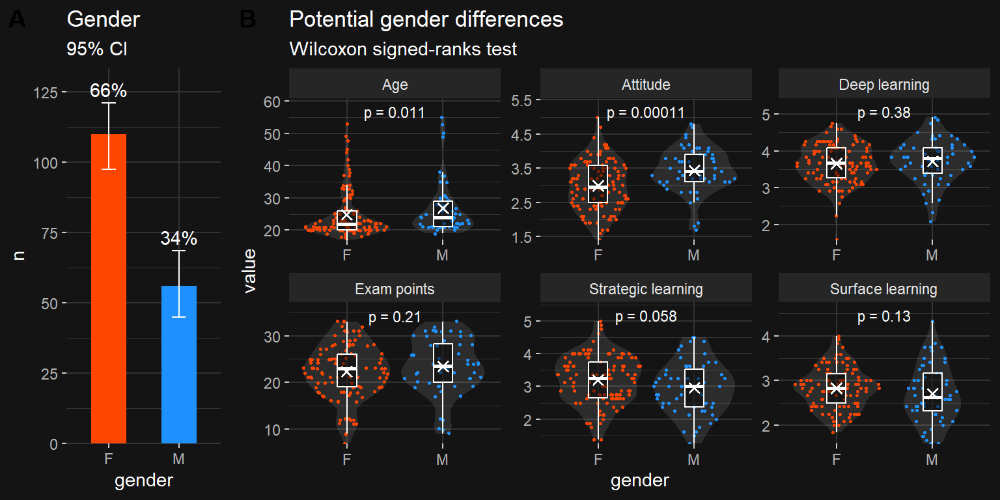

Here it is demonstrated that the strongest correlation is observed between `attitude` and `points`. In men, there is a strong inverse correlation between surface and deep learning, whereas such phenomenon doesn't exist in women. This implies that women may employ both strategies simultaneously, whereas in men these two strategies may be mutually exclusive. 


## 2.3 Regression model

> ### Instructions
> Choose three variables as explanatory variables and fit a regression model where exam points is the target (dependent, outcome) variable. Show a summary of the fitted model and comment and interpret the results. Explain and interpret the statistical test related to the model parameters.

Next I will fit a regression model that looks at the association between `attitude` and exam `points` adjusted for `age` and `gender`.


```r
# Define formula
response <- "points"
IVs <- c("attitude", "age", "gender")
formula <- paste0(response, " ~ ", paste(IVs, collapse = " + "))

# Run initial model
m1 <- lm(formula, data)
m1_s <- summary(m1)
m1_s
```

```
## 
## Call:
## lm(formula = formula, data = data)
## 
## Residuals:
##      Min       1Q   Median       3Q      Max 
## -17.4590  -3.3221   0.2186   4.0247  10.4632 
## 
## Coefficients:
##             Estimate Std. Error t value Pr(>|t|)    
## (Intercept) 13.42910    2.29043   5.863 2.48e-08 ***
## attitude     3.60657    0.59322   6.080 8.34e-09 ***
## age         -0.07586    0.05367  -1.414    0.159    
## genderM     -0.33054    0.91934  -0.360    0.720    
## ---
## Signif. codes:  0 '***' 0.001 '**' 0.01 '*' 0.05 '.' 0.1 ' ' 1
## 
## Residual standard error: 5.315 on 162 degrees of freedom
## Multiple R-squared:  0.2018,	Adjusted R-squared:  0.187 
## F-statistic: 13.65 on 3 and 162 DF,  p-value: 5.536e-08
```

> ### Instructions
> If an explanatory variable in your model does not have a statistically significant relationship with the target variable, remove the variable from the model and fit the model again without it.

Only `attitude` is significant in our model. Let's remove non-significant predictors one by one and do it efficiently in a loop.


```r
# Drop useless covariates in a loop
results <- list(); models <- list()
while (max(m1_s$coefficients[-1, "Pr(>|t|)"]) > 0.05) {
  
  # Identify the most non-significant covariate
  nonsig <- with(m1_s, rownames(coefficients)[
    coefficients[, "Pr(>|t|)"] == max(coefficients[, "Pr(>|t|)"])
  ]); nonsigF <- nonsig # Save "raw" covariate with factor level
  
  # Remove factor value characters
  while (!(nonsig %in% colnames(data))) { 
    nonsig <- substr(nonsig, 1, nchar(nonsig)-1)
  }
  # Store non-significant covariate
  results[[nonsigF]] <- data.frame(
    Dropped = nonsigF,
    P = m1_s$coefficients[nonsigF, "Pr(>|t|)"] %>% signif(3)
  )
  # Remove covariate from model
  IVs <- IVs[!(IVs %in% nonsig)]
  
  # Quit if no predictors left
  if (length(IVs) == 0) {print("All predictors NS"); break}
  if (length(IVs) > 0) {
    formula <- paste0(response, " ~ ", paste(IVs, collapse = " + "))
    m1 <- lm(formula, data); m1_s <- summary(m1)
  } 
}
dropped <- bind_rows(results); dropped %>% knitr::kable()
```


|Dropped |     P|
|:-------|-----:|
|genderM | 0.720|
|age     | 0.144|

Both `gender` and `age` were dropped out one by one due to their non-significant contribution to the model. Let's see if this this decision replicates with official `rms::fastbw` function for backward variable selection:


```r
# Run initial model
m_ols <- rms::ols(points ~ attitude + age + gender, data)

# Backward variable selection based on p value
rms::fastbw(m_ols, rule = "p")
```

```
## 
##  Deleted Chi-Sq d.f. P      Residual d.f. P      AIC   R2   
##  gender  0.13   1    0.7192 0.13     1    0.7192 -1.87 0.201
##  age     2.15   1    0.1426 2.28     2    0.3201 -1.72 0.191
## 
## Approximate Estimates after Deleting Factors
## 
##             Coef   S.E. Wald Z         P
## Intercept 11.637 1.8288  6.363 1.975e-10
## attitude   3.525 0.5669  6.219 5.010e-10
## 
## Factors in Final Model
## 
## [1] attitude
```

Yup, we got the same result -- the only predictor left in the model is `attitude.` Thus, in the final model we'll predict exam `points` with only `attitude`.


## 2.4 Interpretation

> ### Instructions
> Using a summary of your fitted model, explain the relationship between the chosen explanatory variables and the target variable (interpret the model parameters). Explain and interpret the multiple R-squared of the model. (0-3 points)

Let's look at the final model:


```r
# Final model
m1_s
```

```
## 
## Call:
## lm(formula = formula, data = data)
## 
## Residuals:
##      Min       1Q   Median       3Q      Max 
## -16.9763  -3.2119   0.4339   4.1534  10.6645 
## 
## Coefficients:
##             Estimate Std. Error t value Pr(>|t|)    
## (Intercept)  11.6372     1.8303   6.358 1.95e-09 ***
## attitude      3.5255     0.5674   6.214 4.12e-09 ***
## ---
## Signif. codes:  0 '***' 0.001 '**' 0.01 '*' 0.05 '.' 0.1 ' ' 1
## 
## Residual standard error: 5.32 on 164 degrees of freedom
## Multiple R-squared:  0.1906,	Adjusted R-squared:  0.1856 
## F-statistic: 38.61 on 1 and 164 DF,  p-value: 4.119e-09
```

In this model, coefficient for `attitude` is 3.5, which means that each one unit increase in `attitude` corresponds to 3.5 `points` higher exam score. The intercept means that in case `attitude` was zero, the amount of exam `points` would be 11.6. However, this is only theoretical as zero is outside of the likert scale's range (1--5).

R-squared values (both multiple and adjusted = 0.19) show that only a small amount of variation (19%) in exam score can be explained by attitude. This is understandable as a lot of other things, and also our methods of measuring attitude could be imperfect.


## 2.5 Graphical model validation

> ### Instructions
> Produce the following diagnostic plots: Residuals vs Fitted values, Normal QQ-plot and Residuals vs Leverage. Explain the assumptions of the model and interpret the validity of those assumptions based on the diagnostic plots

Linear regression has a few key assumptions:

- **Linear** relationship between the predictor `x` and response `y`.
- **Normality** of the residuals.
- **Homoscedasticity**: the residuals are assumed to have constant variance.

Let's see if our assumptions hold.


```r
# Residuals
model.diag.metrics <- broom::augment(m1)
ggplot(model.diag.metrics, aes(attitude, points)) +
  geom_segment(
    aes(xend = attitude, yend = .fitted),
    color = "orangered2", alpha = .7
  ) +
  geom_point() +
  stat_smooth(color = "white", method = lm, se = FALSE)
```

```
## `geom_smooth()` using formula = 'y ~ x'
```

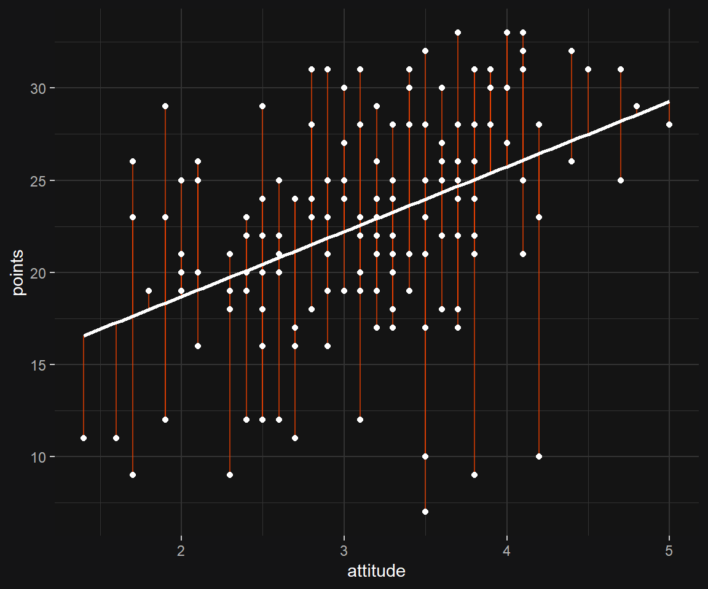

```r
# The actual diagnostic plots
m1_diag <- ggplot2::autoplot(m1, colour = "white", size = .5)
m1_diag
```

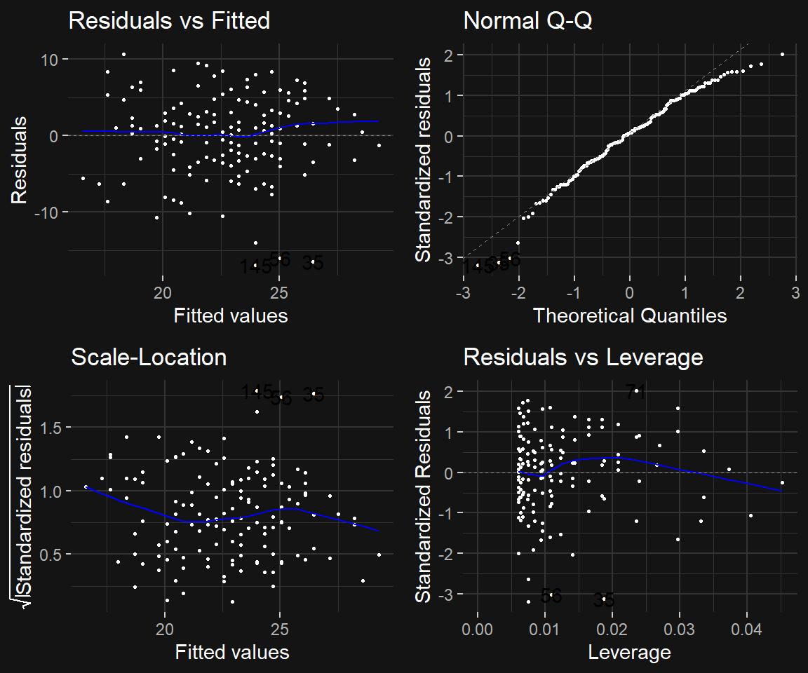


- The **"Residuals vs Fitted"** plot shows a horizontal line, without distinct patterns, which indicates that the predictor and response variables have a linear relationship.
- In the **Normal Q-Q** plot, standardized residuals roughly follow the dashed line and deviate only at extreme quantiles.
- The **Scale-Location** plot shows that residuals spread roughly equally along the range of the predictor, indicating that variances are constant.
- The **Residuals vs Leverage** plot identifies two observations that have standardized residuals greater than absolute value 3, which are possible outliers.

To conclude, the model assumptions hold up quite good.


# 3 Logistic regression
## Setup

First let's load the needed packages and some custom functions.


```r
# Packages
pacman::p_load(tidyverse, GGally, patchwork, ggfortify)

## Defining some custom functions
# Colors
# colorpair <- c("orangered", "dodgerblue")
# color_gender <- \ () {scale_color_manual(values = colorpair)}
# fill_gender <- \ () {scale_fill_manual(values = colorpair)}

# Dark mode theme
theme_darkmode <- \ (backg = "#141415") {
  ggdark::dark_theme_gray() %+replace% 
    ggplot2::theme(
      plot.background = element_rect(color = backg, fill = backg),
      legend.box.background = element_rect(fill = backg, color = backg),
      legend.background = element_rect(fill = backg, color = backg),
      panel.grid = element_line(color = "gray20")
    )
}
```


## 3.2 Get data


```r
# Read data
datasets <- list.files("data/alc/ready", full.names = T)
newest <- datasets %>% sub('.*_', '', .) %>% as.Date() %>% max()
data <- datasets[grepl(newest, datasets)] %>%
  readr::read_csv(show_col_types = F)

# Glance at the data
# glimpse(data)
finalfit::finalfit_glimpse(data)$Continuous %>% select(-label) %>% knitr::kable()
```


|           |var_type |   n| missing_n|missing_percent |mean |sd  |min  |quartile_25 |median |quartile_75 |max  |
|:----------|:--------|---:|---------:|:---------------|:----|:---|:----|:-----------|:------|:-----------|:----|
|age        |<dbl>    | 370|         0|0.0             |16.6 |1.2 |15.0 |16.0        |17.0   |17.0        |22.0 |
|Medu       |<dbl>    | 370|         0|0.0             |2.8  |1.1 |0.0  |2.0         |3.0    |4.0         |4.0  |
|Fedu       |<dbl>    | 370|         0|0.0             |2.6  |1.1 |0.0  |2.0         |3.0    |3.8         |4.0  |
|traveltime |<dbl>    | 370|         0|0.0             |1.4  |0.7 |1.0  |1.0         |1.0    |2.0         |4.0  |
|studytime  |<dbl>    | 370|         0|0.0             |2.0  |0.8 |1.0  |1.0         |2.0    |2.0         |4.0  |
|famrel     |<dbl>    | 370|         0|0.0             |3.9  |0.9 |1.0  |4.0         |4.0    |5.0         |5.0  |
|freetime   |<dbl>    | 370|         0|0.0             |3.2  |1.0 |1.0  |3.0         |3.0    |4.0         |5.0  |
|goout      |<dbl>    | 370|         0|0.0             |3.1  |1.1 |1.0  |2.0         |3.0    |4.0         |5.0  |
|Dalc       |<dbl>    | 370|         0|0.0             |1.5  |0.9 |1.0  |1.0         |1.0    |2.0         |5.0  |
|Walc       |<dbl>    | 370|         0|0.0             |2.3  |1.3 |1.0  |1.0         |2.0    |3.0         |5.0  |
|health     |<dbl>    | 370|         0|0.0             |3.6  |1.4 |1.0  |3.0         |4.0    |5.0         |5.0  |
|failures   |<dbl>    | 370|         0|0.0             |0.2  |0.6 |0.0  |0.0         |0.0    |0.0         |3.0  |
|absences   |<dbl>    | 370|         0|0.0             |4.5  |5.5 |0.0  |1.0         |3.0    |6.0         |45.0 |
|G1         |<dbl>    | 370|         0|0.0             |11.5 |2.7 |2.0  |10.0        |12.0   |14.0        |18.0 |
|G2         |<dbl>    | 370|         0|0.0             |11.5 |2.8 |4.0  |10.0        |12.0   |14.0        |18.0 |
|G3         |<dbl>    | 370|         0|0.0             |11.5 |3.3 |0.0  |10.0        |12.0   |14.0        |18.0 |
|alc_use    |<dbl>    | 370|         0|0.0             |1.9  |1.0 |1.0  |1.0         |1.5    |2.5         |5.0  |


## Description

The `Student Performance` data used for the assignment is from the open [UC Irvine Machine Learning Repository](https://archive.ics.uci.edu/dataset/320/student+performance). Briefly, the data describe student performance in secondary education of two Portuguese schools. Variables include student grades, demographic, social and school related features, based on questionnaire results. The data were processed by computing grades as average performance in two distinct subjects: Mathematics (mat) and Portuguese language (por). More metadata of the two original datasets can be found from `data/alc/docs/student.txt`. 


## 3.3 Hypotheses

> ### Instructions
> -- choose 4 interesting variables in the data and for each of them, present your personal hypothesis about their relationships with alcohol consumption.

I'll choose the following variables and list each corresponding hypothesis after the variable:

1. `traveltime` **home to school travel time**, *numeric:*

    - 1 - <15 min.
    - 2 - 15 to 30 min.
    - 3 - 30 min. to 1 hour
    - 4 - >1 hour

$H_1:$ Location, location, location... Students that live in an urban setting (where the school is) might have easier access to bar and subsequent alcohol use.

2. `studytime` **weekly study time**, *numeric:*

    - 1 - <2 hours
    - 2 - 2 to 5 hours
    - 3 - 5 to 10 hours
    - 4 - >10 hours

$H_1:$ Students that use a lot of alcohol may prioritize drinking in favor of studying. Students that put a lot of effort into studies may be inclined to use less alcohol.

3. `failures` - **number of past class failures**, *numeric:*

    - n if 1<=n<3
    - else 4

$H_1:$ It is plausible that alcohol use impairs cognitive abilities. Poor success in studies, indicated by failing tests and courses could be a sign of alcohol abuse.

4. `romantic`: **with a romantic relationship**, *binary:*

    - yes
    - no

$H_1:$ It is well-known that couples have healthier diet than singles - perhaps this also applies to the fourth macronutrient: alcohol.


## 3.4 Distributions


```r
# Variables and their value labs
vars_hypo <- tribble(
  ~var, ~labs,
  "traveltime", c("<15 min.", "15 to 30 min.", "30 min. to 1 hour", ">1 hour"),
  "studytime", c("<2 hours", "2 to 5 hours", "5 to 10 hours", ">10 hours"),
  "failures", c("n=0", "n=1", "n=2", "n=3"),
  "romantic", c("Taken", "Single")
)

# Plot in a loop
plist <- lapply(1:nrow(vars_hypo), \ (i) {
  p <- data %>%
    mutate(
      !!vars_hypo$var[[i]] := factor(
        .data[[vars_hypo$var[[i]]]],
        labels = vars_hypo$labs[[i]]
      )
    ) %>%
    ggplot(aes(x = .data[[vars_hypo$var[[i]]]]))
  p <- p + geom_bar(aes(fill = .data[[vars_hypo$var[[i]]]]))
  p <- p + theme(
    axis.text.x = element_text(angle = 45, hjust = 1, vjust = 1),
    legend.position = "none"
  )
  p <- p + harrypotter::scale_fill_hp_d("LunaLovegood")
  p
})

ggpubr::ggarrange(
  plotlist = plist,
  align = "hv"
)
```

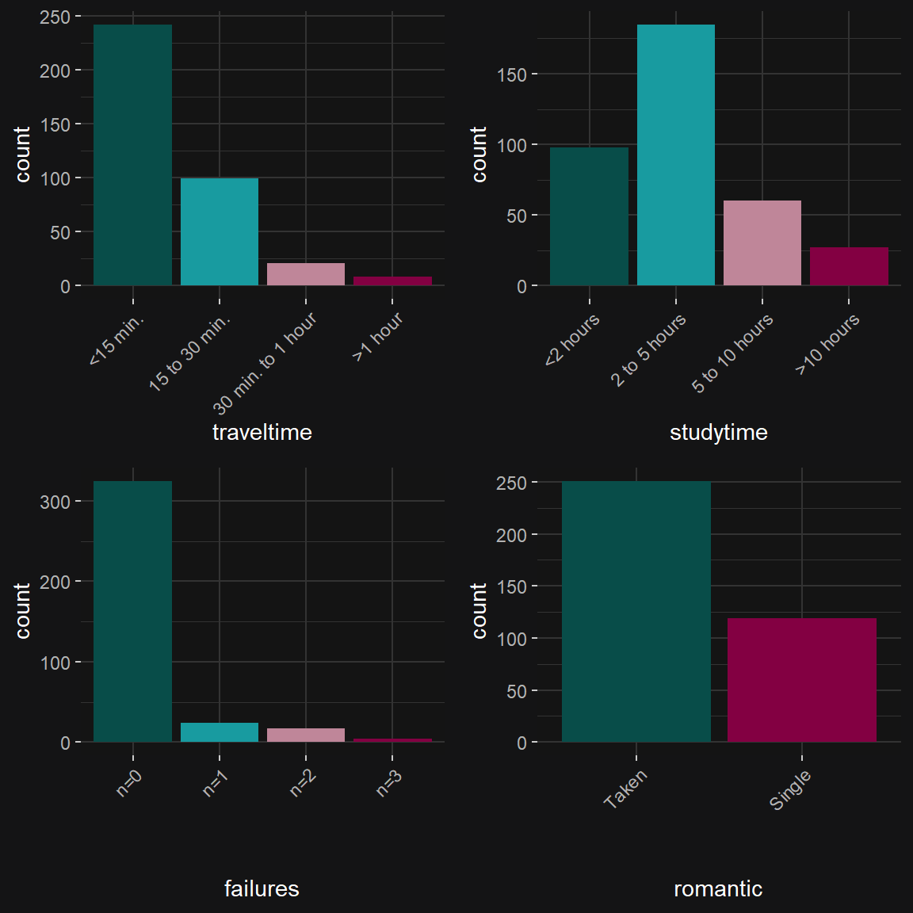

Data are ordinal but not interval, and also heavily skewed. Let's use Spearman correlation coefficient, which is a non-parametric test that works for (at least) ordinal data.


```r
# Plot
data[, c("alc_use", "high_use", vars_hypo$var)] %>%
  GGally::ggpairs(
    mapping = aes(color = romantic, fill = romantic), #, alpha = .3
    upper = list(continuous = wrap("cor", method = "spearman")),
  ) +
  harrypotter::scale_color_hp_d("LunaLovegood") +
  harrypotter::scale_fill_hp_d("LunaLovegood") + 
  ggtitle("Links with alcohol consumption by relationship status")
```


**Interpretation:** We can see that alcohol use is related to lower `studytime` ($r = -0.276$) and higher rate of `failures` ($r = 0.204$), but spearman correlation analysis reveals no significant link with `traveltime` ($r = 0.084$). The inverse relationship between alcohol use and `studytime` may depend on `romantic` status, as a strong, significant correlation coefficient is seen only in single students ($r = -0.321$).


## 3.5 Logistic regression


```r
# Variables
response <- "high_use"
predictors <- vars_hypo$var
form <- as.formula(paste0(response, " ~ ", paste(predictors, collapse = " + ")))

# Fit the model
m1 <- glm(formula = form, data = data)
m1_s <- summary(m1)
m1_s
```

```
## 
## Call:
## glm(formula = form, data = data)
## 
## Deviance Residuals: 
##     Min       1Q   Median       3Q      Max  
## -0.7727  -0.3221  -0.2293   0.5075   0.9569  
## 
## Coefficients:
##             Estimate Std. Error t value Pr(>|t|)    
## (Intercept)  0.38023    0.08283   4.590  6.1e-06 ***
## traveltime   0.06816    0.03321   2.052 0.040865 *  
## studytime   -0.09312    0.02795  -3.331 0.000953 ***
## failures     0.11643    0.04261   2.732 0.006597 ** 
## romanticyes -0.03282    0.04934  -0.665 0.506412    
## ---
## Signif. codes:  0 '***' 0.001 '**' 0.01 '*' 0.05 '.' 0.1 ' ' 1
## 
## (Dispersion parameter for gaussian family taken to be 0.1959533)
## 
##     Null deviance: 77.700  on 369  degrees of freedom
## Residual deviance: 71.523  on 365  degrees of freedom
## AIC: 453.93
## 
## Number of Fisher Scoring iterations: 2
```

```r
# ORs and their CIs
CIs <- data.frame(
  OR = coef(m1) %>% exp() %>% round(3), # Odds ratios
  Lower = confint(m1)[, "2.5 %"] %>% exp() %>% round(3), # 95% CIs
  Upper = confint(m1)[, "97.5 %"] %>% exp() %>% round(3), # 95% CIs
  P = m1_s$coefficients[, "Pr(>|t|)"] %>% gtsummary::style_pvalue(prepend_p = T)
) %>% rownames_to_column(var = "Predictor")

# Plot estimates
p <- CIs %>%
  filter(Predictor != "(Intercept)") %>%
  ggplot(aes(x = OR, y = Predictor))
p <- p + geom_vline(xintercept = 1)
p <- p + geom_pointrange(aes(xmin = Lower, xmax = Upper), size = 1)
p <- p + geom_text(aes(
  label = paste0(P, "\n\n")
))
p <- p + theme(
  panel.grid.major.y = element_blank(), panel.grid.minor.y = element_blank()
)
p <- p + scale_x_continuous(trans = "log2", breaks = c(.8, .9, 1, 1.1, 1.2))
p <- p + ggtitle("Forest plot") + xlab("OR for high alcohol use (95% CI)") + ylab("")
p
```

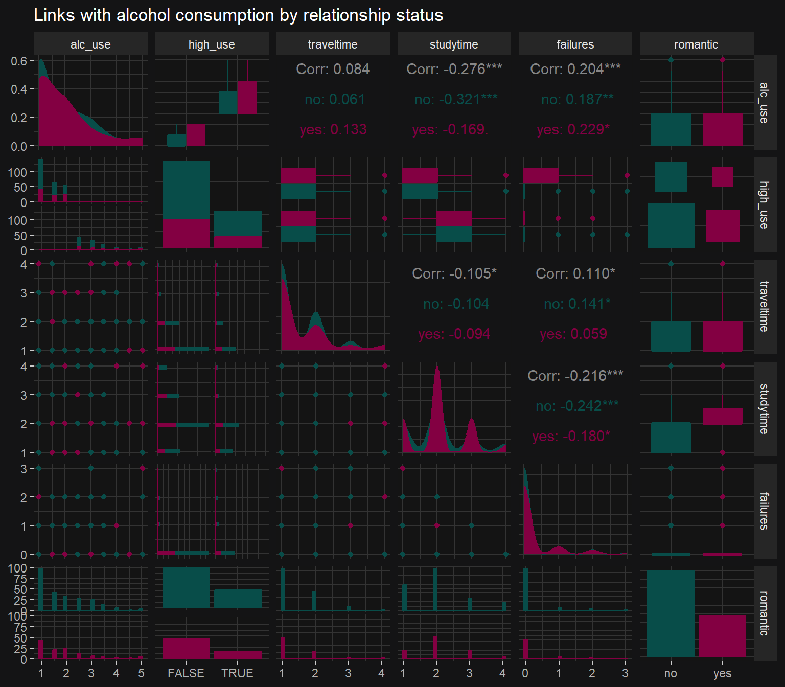

```r
# Numeric output
CIs %>% knitr::kable()
```


|Predictor   |    OR| Lower| Upper|P       |
|:-----------|-----:|-----:|-----:|:-------|
|(Intercept) | 1.463| 1.243| 1.720|p<0.001 |
|traveltime  | 1.071| 1.003| 1.143|p=0.041 |
|studytime   | 0.911| 0.863| 0.962|p<0.001 |
|failures    | 1.123| 1.033| 1.221|p=0.007 |
|romanticyes | 0.968| 0.879| 1.066|p=0.5   |

**Interpretation:** Odds ratios measure the association between exposure(s) and outcome (high alcohol use). An OR greater than 1 indicates that exposed individuals are more likely high alcohol users. OR smaller than 1 leads us to believe that the exposure is more common in *low* alcohol users. If the 95% confidence interval overlaps 1 (null), we can not reject null hypothesis $H_0$ with confidence level $a = 0.05$. 

As we see from the forest plot and counter to our hypothesis, longer `traveltime` is borderline significantly associated with high alcohol use. As hypothesized above, `studytime` shows **inverse** association with high alcohol use and failures a **positive** association.


## 3.6 Predictive power


```r
# Significant variables
sig_vars <- rownames(m1_s$coefficients)[which(m1_s$coefficients[, "Pr(>|t|)"] < .05)][-1]

# Fit the model
form <- as.formula(paste0(response, " ~ ", paste(sig_vars, collapse = " + ")))
m1 <- glm(formula = form, data = data)
m1_s <- summary(m1)
m1_s
```

```
## 
## Call:
## glm(formula = form, data = data)
## 
## Deviance Residuals: 
##     Min       1Q   Median       3Q      Max  
## -0.7595  -0.3201  -0.2519   0.5178   0.9359  
## 
## Coefficients:
##             Estimate Std. Error t value Pr(>|t|)    
## (Intercept)  0.37144    0.08171   4.546 7.45e-06 ***
## traveltime   0.06820    0.03319   2.055 0.040590 *  
## studytime   -0.09389    0.02791  -3.365 0.000848 ***
## failures     0.11517    0.04254   2.707 0.007100 ** 
## ---
## Signif. codes:  0 '***' 0.001 '**' 0.01 '*' 0.05 '.' 0.1 ' ' 1
## 
## (Dispersion parameter for gaussian family taken to be 0.1956548)
## 
##     Null deviance: 77.70  on 369  degrees of freedom
## Residual deviance: 71.61  on 366  degrees of freedom
## AIC: 452.37
## 
## Number of Fisher Scoring iterations: 2
```

```r
# Prediction and observing the data
prob <- predict(m1, type = "response")
data <- mutate(data, probability = prob)
data <- mutate(data, prediction = probability > 0.5)

# 2x2 cross tabulation
data %>% 
  {table(IRL = .$high_use, prediction = .$prediction)}
```

```
##        prediction
## IRL     FALSE TRUE
##   FALSE   250    9
##   TRUE     94   17
```

```r
# Table the target variable versus the predictions
data %>%
  {table(IRL_use = .$high_use, predicted_use = .$prediction)} %>%
  prop.table() %>% addmargins() %>% round(2)
```

```
##        predicted_use
## IRL_use FALSE TRUE  Sum
##   FALSE  0.68 0.02 0.70
##   TRUE   0.25 0.05 0.30
##   Sum    0.93 0.07 1.00
```

```r
# Average number of wrong predictions in the (training) data
loss_func <- function (class, prob) {
  n_wrong <- abs(class - prob) > 0.5
  mean(n_wrong)
}

# Call loss_func
loss_func(class = data$high_use, prob = 0)
```

```
## [1] 0.3
```

```r
loss_func(class = data$high_use, prob = 1)
```

```
## [1] 0.7
```

```r
data %>% {loss_func(class = .$high_use, prob = .$probability)}
```

```
## [1] 0.2783784
```

```r
## Compute AUC metrics
# Our model
perf_m1 <- ROCR::prediction(prob, data$high_use) %>%
  ROCR::performance(measure = "tpr", x.measure = "fpr")

# Simple guessing strategy
guess_fun <- \ (i) {
  truth <- runif(1:length(i), min = 0, max = 1) %>% return()
}
guessings <- guess_fun(m1$residuals)
perf_guess <- ROCR::prediction(guessings, data$high_use) %>%
  ROCR::performance(measure = "tpr", x.measure = "fpr")


# Plot ROC curve
p <- ggplot()
p <- p + geom_abline(slope = 1, intercept = 0, color = "gray80")
p <- p + geom_line(
  linetype = "dashed", size = 1,
  aes(x = perf_m1@x.values[[1]], y = perf_m1@y.values[[1]], color = "Model")
)
```

```
## Warning: Using `size` aesthetic for lines was deprecated in ggplot2 3.4.0.
## ℹ Please use `linewidth` instead.
```

```r
p <- p + geom_line(
  linetype = "dashed", size = 1,
  aes(x = perf_guess@x.values[[1]], y = perf_guess@y.values[[1]], color = "Guess")
)
p <- p + xlab(perf_m1@x.name) + ylab(perf_m1@y.name)
p <- p + scale_color_manual(name = "Model", values = c("orangered", "orange"))
p
```

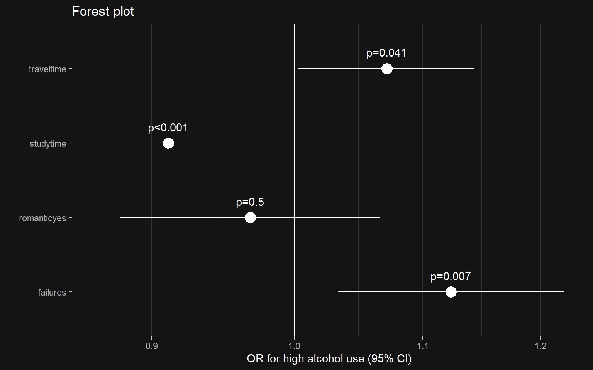

Our model resulted in 25% false negatives and 2% false positives. There were 5% true positives and 68% true negatives, indicating that our model has good specificity. Although our model is not perfect, it performs much better than a **simple guessing strategy** (flipping a coin), as demonstrated with the ROC curves. 


## 3.7 Bonus: 10-fold cross-validation


```r
# Perform 10-fold CV
# Define a loss function (average prediction error)
loss_func <- function(class, prob) {
  n_wrong <- abs(class - prob) > 0.5
  mean(n_wrong)
}

# K-fold cross-validation
cv <- boot::cv.glm(
  data = data,
  cost = loss_func,
  glmfit = m1,
  K = 10
)

# Average number of wrong predictions in the cross validation
cv$delta[1]
```

```
## [1] 0.2972973
```

The average percentage of wrong predictions in the cross validation was ~30%, which is pretty high and higher than in the `Exercise3.Rmd` set (26%). We might not have the best variables or enough of them in the model.

Let's try making a model that has smaller prediction error.


```r
# Lets try this one variable at a time
vars <- names(data)[!(names(data) %in% c(
  "alc_use", "high_use", "Dalc", "Walc", "probability", "prediction"
))]

# Most important vars
form <- as.formula(paste0("high_use ~ ", paste(vars, collapse = " + ")))
m <- glm(formula = form, family = "binomial", data = data)
# m %>% summary()

# Variable Importance
importance <- caret::varImp(m, scale = FALSE) %>%
  arrange(Overall) %>%
  rownames_to_column("Variable")
importance %>%
  ggplot(aes(x = reorder(Variable, Overall), y = Overall)) + geom_col() +
  theme(axis.text.x = element_text(angle = 45, hjust = 1, vjust = 1))
```


```r
# Loop
results <- list()
for (var in vars) {
  form <- as.formula(paste0("high_use ~ ", var))
  m_s <- glm(formula = form, family = "binomial", data = data) %>% summary()
  results[[var]] <- data.frame(
    var = var,
    P = m_s$coefficients[2, "Pr(>|z|)"]
  )
}
results <- bind_rows(results) %>% arrange(P) 
results %>% knitr::kable() 
```


|var        |         P|
|:----------|---------:|
|goout      | 0.0000000|
|studytime  | 0.0000566|
|sex        | 0.0000867|
|absences   | 0.0001296|
|failures   | 0.0006145|
|freetime   | 0.0020304|
|G1         | 0.0037001|
|G2         | 0.0075765|
|traveltime | 0.0086875|
|G3         | 0.0121759|
|famrel     | 0.0204223|
|higher     | 0.0255062|
|age        | 0.0437592|
|address    | 0.0674297|
|health     | 0.1343485|
|famsize    | 0.1442606|
|nursery    | 0.2086710|
|activities | 0.2294490|
|reason     | 0.2619576|
|schoolsup  | 0.3676697|
|guardian   | 0.3960535|
|school     | 0.3968021|
|Fjob       | 0.4182266|
|famsup     | 0.4397546|
|internet   | 0.5098542|
|romantic   | 0.5121903|
|paid       | 0.5246335|
|Pstatus    | 0.8226210|
|Mjob       | 0.8632720|
|Fedu       | 0.9001225|
|Medu       | 0.9331558|

```r
# Pick most promising ones
form <- as.formula(paste0("high_use ~ ", paste(results$var[1:5], collapse = " + ")))
m1 <- glm(formula = form, family = "binomial", data = data)
m_s <- summary(m1)
m_s
```

```
## 
## Call:
## glm(formula = form, family = "binomial", data = data)
## 
## Deviance Residuals: 
##     Min       1Q   Median       3Q      Max  
## -2.1901  -0.7637  -0.4999   0.7560   2.4494  
## 
## Coefficients:
##             Estimate Std. Error z value Pr(>|z|)    
## (Intercept) -3.28866    0.60304  -5.453 4.94e-08 ***
## goout        0.70261    0.12135   5.790 7.03e-09 ***
## studytime   -0.37986    0.17479  -2.173 0.029757 *  
## sexM         0.82696    0.27173   3.043 0.002340 ** 
## absences     0.07747    0.02272   3.410 0.000649 ***
## failures     0.38962    0.23608   1.650 0.098860 .  
## ---
## Signif. codes:  0 '***' 0.001 '**' 0.01 '*' 0.05 '.' 0.1 ' ' 1
## 
## (Dispersion parameter for binomial family taken to be 1)
## 
##     Null deviance: 452.04  on 369  degrees of freedom
## Residual deviance: 364.54  on 364  degrees of freedom
## AIC: 376.54
## 
## Number of Fisher Scoring iterations: 4
```

```r
# Backward variable selection
step_m <- MASS::stepAIC(m1, direction = "both", trace = F)
step_m %>% summary()
```

```
## 
## Call:
## glm(formula = high_use ~ goout + studytime + sex + absences + 
##     failures, family = "binomial", data = data)
## 
## Deviance Residuals: 
##     Min       1Q   Median       3Q      Max  
## -2.1901  -0.7637  -0.4999   0.7560   2.4494  
## 
## Coefficients:
##             Estimate Std. Error z value Pr(>|z|)    
## (Intercept) -3.28866    0.60304  -5.453 4.94e-08 ***
## goout        0.70261    0.12135   5.790 7.03e-09 ***
## studytime   -0.37986    0.17479  -2.173 0.029757 *  
## sexM         0.82696    0.27173   3.043 0.002340 ** 
## absences     0.07747    0.02272   3.410 0.000649 ***
## failures     0.38962    0.23608   1.650 0.098860 .  
## ---
## Signif. codes:  0 '***' 0.001 '**' 0.01 '*' 0.05 '.' 0.1 ' ' 1
## 
## (Dispersion parameter for binomial family taken to be 1)
## 
##     Null deviance: 452.04  on 369  degrees of freedom
## Residual deviance: 364.54  on 364  degrees of freedom
## AIC: 376.54
## 
## Number of Fisher Scoring iterations: 4
```

```r
# Perform 10-fold CV
cv <- boot::cv.glm(
  data = data,
  cost = loss_func,
  glmfit = step_m,
  K = 10
)

# Average number of wrong predictions in the cross validation
cv$delta[1]
```

```
## [1] 0.2162162
```

Now we got a smaller prediction error using 10-fold cross-validation compared to the Exercise Set (0.22 *vs.* 0.26)!


## 3.8 Super-Bonus: different sets of predictors

Finding out what is the optimal number of predictors to achieve as little prediction error as possible!


```r
# In a loop based on importance
importance <- caret::varImp(m, scale = FALSE) %>%
  arrange(Overall) %>%
  rownames_to_column("Variable")

# Remove factor levels from tailing the column names
vars <- c()
for (var in importance$Variable) {
  while (!(var %in% names(data))) {
    var <- stringr::str_sub(var, end = -2)
  }
  vars <- c(vars, var)
}

# The actual loop
results <- list()
while (length(vars) >= 2) {
  vars <- tail(vars, -1)
  cat(paste0(length(vars)), "  ")
  
  # Formula
  form <- as.formula(paste0("high_use ~ ", paste(vars, collapse = " + ")))
  
  # Model
  loop_m <- glm(formula = form, family = "binomial", data = data)
  
  # Perform 10-fold CV
  cv <- boot::cv.glm(
    data = data,
    cost = loss_func,
    glmfit = loop_m,
    K = 10
  )
  
  # Pick relevant stuff into a row
  results[[length(vars)]] <- data.frame(
    N_variables = length(vars),
    Avg_wrong_preds = cv$delta[1] # Avg N of wrong predictions
  )
}
```

```
## 39   38   37   36   35   34   33   32   31   30   29   28   27   26   25   24   23   22   21   20   19   18   17   16   15   14   13   12   11   10   9   8   7   6   5   4   3   2   1
```

```r
results <- bind_rows(results)# %>% arrange(P) 
results %>% ggplot(aes(x = N_variables, y = Avg_wrong_preds)) +
  geom_point() + geom_smooth()
```

```
## `geom_smooth()` using method = 'loess' and formula = 'y ~ x'
```

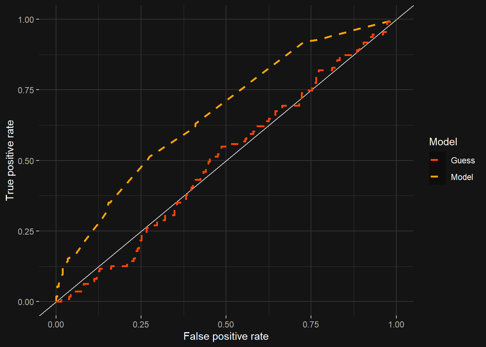


We have now demonstrated that lowest prediction error is achieved by including ~10 of the important variables!!


# 4 Clustering and classification
## Setup

First let's load the needed packages and some custom functions.


```r
# Packages
pacman::p_load(tidyverse)

# Custom functions
source("src/fig_setup.R")

start.time <- Sys.time()
```


## 4.2 Get data

> ### Instructions
> Load the Boston data from the MASS package. Explore the structure and the dimensions of the data and describe the dataset briefly, assuming the reader has no previous knowledge of it. Details about the Boston dataset can be seen for example here. (0-1 points)

Save the data to an object and check its structure


```r
# Read data
data <- MASS::Boston

# Glance at the data
finalfit::finalfit_glimpse(data)$Continuous %>%
  select(-label) %>%
  knitr::kable()
```


|        |var_type |   n| missing_n|missing_percent |mean  |sd    |min   |quartile_25 |median |quartile_75 |max   |
|:-------|:--------|---:|---------:|:---------------|:-----|:-----|:-----|:-----------|:------|:-----------|:-----|
|crim    |<dbl>    | 506|         0|0.0             |3.6   |8.6   |0.0   |0.1         |0.3    |3.7         |89.0  |
|zn      |<dbl>    | 506|         0|0.0             |11.4  |23.3  |0.0   |0.0         |0.0    |12.5        |100.0 |
|indus   |<dbl>    | 506|         0|0.0             |11.1  |6.9   |0.5   |5.2         |9.7    |18.1        |27.7  |
|chas    |<int>    | 506|         0|0.0             |0.1   |0.3   |0.0   |0.0         |0.0    |0.0         |1.0   |
|nox     |<dbl>    | 506|         0|0.0             |0.6   |0.1   |0.4   |0.4         |0.5    |0.6         |0.9   |
|rm      |<dbl>    | 506|         0|0.0             |6.3   |0.7   |3.6   |5.9         |6.2    |6.6         |8.8   |
|age     |<dbl>    | 506|         0|0.0             |68.6  |28.1  |2.9   |45.0        |77.5   |94.1        |100.0 |
|dis     |<dbl>    | 506|         0|0.0             |3.8   |2.1   |1.1   |2.1         |3.2    |5.2         |12.1  |
|rad     |<int>    | 506|         0|0.0             |9.5   |8.7   |1.0   |4.0         |5.0    |24.0        |24.0  |
|tax     |<dbl>    | 506|         0|0.0             |408.2 |168.5 |187.0 |279.0       |330.0  |666.0       |711.0 |
|ptratio |<dbl>    | 506|         0|0.0             |18.5  |2.2   |12.6  |17.4        |19.1   |20.2        |22.0  |
|black   |<dbl>    | 506|         0|0.0             |356.7 |91.3  |0.3   |375.4       |391.4  |396.2       |396.9 |
|lstat   |<dbl>    | 506|         0|0.0             |12.7  |7.1   |1.7   |6.9         |11.4   |17.0        |38.0  |
|medv    |<dbl>    | 506|         0|0.0             |22.5  |9.2   |5.0   |17.0        |21.2   |25.0        |50.0  |

```r
# Uncomment for data description
# ?MASS::Boston
```

The [`Boston`](https://stat.ethz.ch/R-manual/R-devel/library/MASS/html/Boston.html) data contains information about suburbs in Boston, Massachusetts. It is from the `MASS` package and has 506 rows and 14 columns. Briefly, the data describe . 

- `crim`: per capita crime rate by town.
- `zn`: proportion of residential land zoned for lots over 25,000 sq.ft.
- `indus`: proportion of non-retail business acres per town.
- `chas`: Charles River dummy variable (= 1 if tract bounds river; 0 otherwise).
- `nox`: nitrogen oxides concentration (parts per 10 million).
- `rm`: average number of rooms per dwelling.
- `age`: proportion of owner-occupied units built prior to 1940.
- `dis`: weighted mean of distances to five Boston employment centres.
- `rad`: index of accessibility to radial highways.
- `tax`: full-value property-tax rate per $10,000.
- `ptratio`: pupil-teacher ratio by town.
- `black`: the proportion of blacks by town.
- `lstat`: lower status of the population (percent).
- `medv`: median value of owner-occupied homes in $1000s.


**Source**

- Harrison, D. and Rubinfeld, D.L. (1978) Hedonic prices and the demand for clean air. *J. Environ. Economics and Management* 5, 81–102.

- Belsley D.A., Kuh, E. and Welsch, R.E. (1980) *Regression Diagnostics. Identifying Influential Data and Sources of Collinearity.* New York: Wiley.


## 4.3 Visualize

> ### Instructions
> Show a graphical overview of the data and show summaries of the variables in the data. Describe and interpret the outputs, commenting on the distributions of the variables and the relationships between them. (0-2 points)

Let's start by exploring our data.


```r
# "chas" to nominal
# data <- data %>%
#   mutate(
#     chas = case_when(
#       chas == 1 ~ "Bounds river",
#       T ~ "Does not bound river"
#     )
#   )

# Plot
data %>%
  GGally::ggpairs(
    lower = list(continuous = "points", size = .01),
    upper = list(continuous = GGally::wrap("cor", method = "spearman")),
  )
```

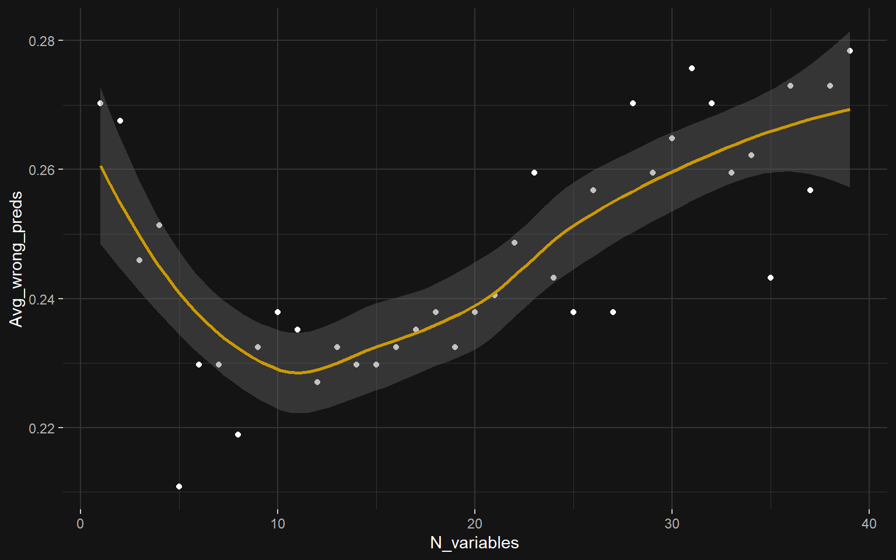

### Distributions

The distributions of `crim`, `zn`, `age`, `dis`, `pratio`, `black`, `lstat` are heavily skewed and it is questionable to apply any parametric statistics on them (without any transformations such as box-cox or ordernorm). Variables `indus`, `rad`, `tax` have *multimodal distributions* with two distinct peaks. The variable `chas` is a dichotomous nominal variable coded as 0 and 1.


### Relationships

The majority of the variables are intercorrelated. For example, there is a strong positive association between `nox` and `crim` ($\rho = 0.82$). `lstat` and `medv` are inversely correlated ($\rho = -0.85$)


## 4.4 Standardize

> ### Instructions
> Standardize the dataset and print out summaries of the scaled data. How did the variables change? Create a categorical variable of the crime rate in the Boston dataset (from the scaled crime rate). Use the quantiles as the break points in the categorical variable. Drop the old crime rate variable from the dataset. Divide the dataset to train and test sets, so that 80% of the data belongs to the train set. (0-2 points)

Let's scale the data so that every variable has a mean $\overline{x} = 0$ and sd $σ = 1$. 


```r
# Standardize
data_z <- scale(data) %>% data.frame()

# Cut into quartiles
quant <- 4
data_z <- data_z %>% mutate(
  crime_quant = gtools::quantcut(crim, q = 4, labels = paste0("Q", 1:quant))
) %>% select(-crim) # Remove original "crim"

# Summaries
summs <- finalfit::finalfit_glimpse(data_z) 
summs[[1]] %>% knitr::kable()
```


|        |label   |var_type |   n| missing_n|missing_percent |mean |sd  |min  |quartile_25 |median |quartile_75 |max |
|:-------|:-------|:--------|---:|---------:|:---------------|:----|:---|:----|:-----------|:------|:-----------|:---|
|zn      |zn      |<dbl>    | 506|         0|0.0             |0.0  |1.0 |-0.5 |-0.5        |-0.5   |0.0         |3.8 |
|indus   |indus   |<dbl>    | 506|         0|0.0             |0.0  |1.0 |-1.6 |-0.9        |-0.2   |1.0         |2.4 |
|chas    |chas    |<dbl>    | 506|         0|0.0             |-0.0 |1.0 |-0.3 |-0.3        |-0.3   |-0.3        |3.7 |
|nox     |nox     |<dbl>    | 506|         0|0.0             |-0.0 |1.0 |-1.5 |-0.9        |-0.1   |0.6         |2.7 |
|rm      |rm      |<dbl>    | 506|         0|0.0             |-0.0 |1.0 |-3.9 |-0.6        |-0.1   |0.5         |3.6 |
|age     |age     |<dbl>    | 506|         0|0.0             |-0.0 |1.0 |-2.3 |-0.8        |0.3    |0.9         |1.1 |
|dis     |dis     |<dbl>    | 506|         0|0.0             |0.0  |1.0 |-1.3 |-0.8        |-0.3   |0.7         |4.0 |
|rad     |rad     |<dbl>    | 506|         0|0.0             |0.0  |1.0 |-1.0 |-0.6        |-0.5   |1.7         |1.7 |
|tax     |tax     |<dbl>    | 506|         0|0.0             |0.0  |1.0 |-1.3 |-0.8        |-0.5   |1.5         |1.8 |
|ptratio |ptratio |<dbl>    | 506|         0|0.0             |-0.0 |1.0 |-2.7 |-0.5        |0.3    |0.8         |1.6 |
|black   |black   |<dbl>    | 506|         0|0.0             |-0.0 |1.0 |-3.9 |0.2         |0.4    |0.4         |0.4 |
|lstat   |lstat   |<dbl>    | 506|         0|0.0             |-0.0 |1.0 |-1.5 |-0.8        |-0.2   |0.6         |3.5 |
|medv    |medv    |<dbl>    | 506|         0|0.0             |-0.0 |1.0 |-1.9 |-0.6        |-0.1   |0.3         |3.0 |

```r
summs[[2]] %>% knitr::kable()
```


|            |label       |var_type |   n| missing_n|missing_percent | levels_n|levels                              |levels_count       |levels_percent |
|:-----------|:-----------|:--------|---:|---------:|:---------------|--------:|:-----------------------------------|:------------------|:--------------|
|crime_quant |crime_quant |<fct>    | 506|         0|0.0             |        4|"Q1", "Q2", "Q3", "Q4", "(Missing)" |127, 126, 126, 127 |25, 25, 25, 25 |

Let's divide 80% of the data to train and 20% test sets.


```r
# N of rows in the data
n <- nrow(data_z)

# Choose randomly 80% of the rows
ind <- sample(n, size = n * 0.8)

# Create train and test sets
train <- data_z[ind, ]
test <- data_z[-ind, ]
```


## 4.5 Discriminant analysis

> ### Instructions
> Fit the linear discriminant analysis on the train set. Use the categorical crime rate as the target variable and all the other variables in the dataset as predictor variables. Draw the LDA (bi)plot. (0-3 points)


```r
# Fit the LDA analysis on train set
lda.fit <- MASS::lda(crime_quant ~ ., data = train)
lda.fit
```

```
## Call:
## lda(crime_quant ~ ., data = train)
## 
## Prior probabilities of groups:
##        Q1        Q2        Q3        Q4 
## 0.2475248 0.2450495 0.2425743 0.2648515 
## 
## Group means:
##             zn      indus         chas        nox         rm        age
## Q1  1.02182063 -0.9885758 -0.154216061 -0.8797731  0.3986461 -0.9136391
## Q2 -0.09874734 -0.2847441  0.006051757 -0.5821980 -0.1440474 -0.3801992
## Q3 -0.38048487  0.2093301  0.169590347  0.3770588  0.1819993  0.4123340
## Q4 -0.48724019  1.0170108 -0.088352421  1.0408679 -0.4304584  0.8300615
##           dis        rad        tax     ptratio       black       lstat
## Q1  0.9677150 -0.6844182 -0.7092631 -0.36977078  0.37982825 -0.77853457
## Q2  0.3565096 -0.5572864 -0.5031100 -0.08957151  0.31327294 -0.13310878
## Q3 -0.3572826 -0.3783401 -0.2815489 -0.27687124  0.09202352 -0.05798629
## Q4 -0.8622166  1.6392096  1.5148289  0.78203563 -0.82112811  0.90695989
##            medv
## Q1  0.458317492
## Q2  0.008404242
## Q3  0.221437249
## Q4 -0.692934774
## 
## Coefficients of linear discriminants:
##                  LD1         LD2         LD3
## zn       0.065709106  0.79658688 -0.83791503
## indus    0.061065042 -0.58238916  0.43142929
## chas    -0.098378505 -0.02081559  0.09412104
## nox      0.438876470 -0.48312241 -1.48769119
## rm      -0.085621500 -0.11971089 -0.19651825
## age      0.291713381 -0.28111624 -0.35020079
## dis      0.003985346 -0.31252104 -0.03256168
## rad      3.001376093  0.72339152  0.22912586
## tax     -0.036843856  0.18083433  0.22728074
## ptratio  0.112619004  0.14275971 -0.36608584
## black   -0.112658113 -0.02286313  0.08324817
## lstat    0.213601382 -0.16896124  0.41248316
## medv     0.189887846 -0.33773969 -0.24301806
## 
## Proportion of trace:
##    LD1    LD2    LD3 
## 0.9421 0.0420 0.0158
```

```r
# Draw the LDA biplot
p <- ggord::ggord(
  lda.fit,
  train$crime_quant,
  size = 1,
  labcol = "white",
  veccol = "white",
  repel = T
)
# p <- p + ggsci::scale_color_lancet()
# p <- p + ggsci::scale_fill_lancet()
pal <- "PonyoMedium"
p <- p + ghibli::scale_color_ghibli_d(pal)
p <- p + ghibli::scale_fill_ghibli_d(pal)
p <- p + theme_darkmode()

# Print without white edges
grid::grid.newpage()
grid::grid.draw(grid::rectGrob(gp = grid::gpar(fill = backg)))
print(p, newpage = FALSE)
```

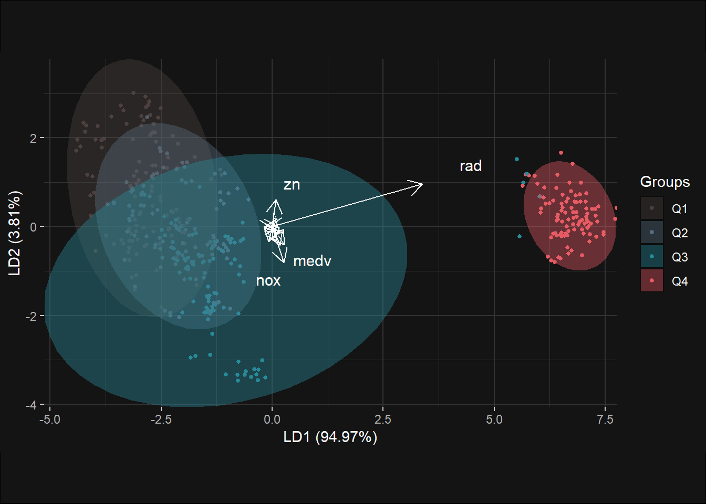


## 4.6 Class prediction

> ### Instructions
> Save the crime categories from the test set and then remove the categorical crime variable from the test dataset. Then predict the classes with the LDA model on the test data. Cross tabulate the results with the crime categories from the test set. Comment on the results. (0-3 points)


```r
# Save the correct classes from test data
correct_classes <- test$crime_quant

# Predict classes with test data
lda.pred <- predict(lda.fit, newdata = test)

# cross tabulate the results
ctab <- table(correct = correct_classes, predicted = lda.pred$class)
ctab; ctab %>% prop.table() %>% round(2) #%>% {. * 100}
```

```
##        predicted
## correct Q1 Q2 Q3 Q4
##      Q1  9 16  2  0
##      Q2  4 19  4  0
##      Q3  0  9 19  0
##      Q4  0  0  0 20
```

```
##        predicted
## correct   Q1   Q2   Q3   Q4
##      Q1 0.09 0.16 0.02 0.00
##      Q2 0.04 0.19 0.04 0.00
##      Q3 0.00 0.09 0.19 0.00
##      Q4 0.00 0.00 0.00 0.20
```

The confusion matrix above tells us that most classes were predicted correctly. Predictions for Q1 suburbs were spread broadly across three different quartiles, whereas most/all Q4 suburbs were correctly classified. There were some false positives as well as negatives.


```r
# Overall model accuracy
accuracy <- mean(lda.pred$class == correct_classes) %>% scales::percent()
accuracy
```

```
## [1] "66%"
```

```r
# Misclassification rate
misclass <- mean(lda.pred$class != correct_classes) %>% scales::percent()
misclass
```

```
## [1] "34%"
```

In general, model accuracy is 66% and misclassification rate 34%. Since the training and testing sets are randomly assigned, the results change every time the code is run. Crossvalidation could provide better credence for evaluating the model performance.


## 4.7 Clustering

> ### Instructions
> Reload the Boston dataset and standardize the dataset (we did not do this in the Exercise Set, but you should scale the variables to get comparable distances). Calculate the distances between the observations. Run k-means algorithm on the dataset. Investigate what is the optimal number of clusters and run the algorithm again. Visualize the clusters (for example with the pairs() or ggpairs() functions, where the clusters are separated with colors) and interpret the results. (0-4 points)

Let's scale the dataset and calculate Eucledian distances between the observations.


```r
# Reload the dataset
boston <- MASS::Boston

# Standardize
boston_z <- boston %>%
  scale() %>%
  data.frame()

# Calculate distances between observations
dist_eu <- dist(boston_z)
summary(dist_eu)
```

```
##    Min. 1st Qu.  Median    Mean 3rd Qu.    Max. 
##  0.1343  3.4625  4.8241  4.9111  6.1863 14.3970
```


```r
# Determine max N of clusters
k_max <- 10

# Calculate total within-cluster sum of squares (TWSS) for different cluster numbers
TWSS <- sapply(1:k_max, \ (k) kmeans(boston_z, centers = k)$tot.withinss)

# Visualize 
data.frame(N = 1:length(TWSS), TWSS) %>%
  ggplot(aes(x = N, y = TWSS)) +
  geom_point(size = 4) + geom_line() +
  scale_x_continuous(breaks = 1:k_max) +
  xlab("Number of clusters") + ylab("Total of Within Cluster Sum of Squares")
```

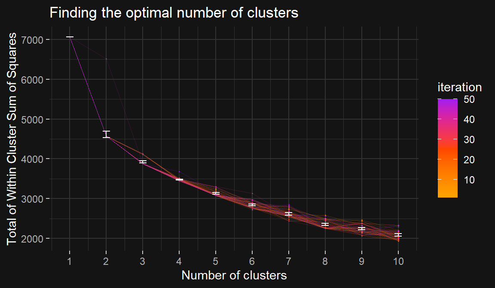

The line chart shows that a dramatic drop is achieved when increasing the number of clusters from `1` to `2`. Only diminshing returns are achieved after this drop. Thus, we we will continue with `2` clusters. 


```r
# Calculate k-means with optimal N of clusters
km <- kmeans(boston_z, centers = 2)

# Add clusters to data frame
boston_z <- boston_z %>%
  mutate(
    cluster = factor(km$cluster)
  )

# Plot
boston_z %>%
  reshape2::melt(id.vars = "cluster") %>%
  ggplot(aes(x = cluster, y = value, color = cluster)) +
  ggforce::geom_sina(size = .5, alpha = .7) +
  ggpubr::stat_compare_means(vjust = 1, aes(x = 1.5, label = after_stat(p.signif))) +
  scale_color_manual(values = c("orange", "orangered2")) +
  xlab("Cluster") + ylab("Standard deviations") +
  facet_wrap(. ~ variable)
```


## Bonus

> ### Instructions
> Perform k-means on the original Boston data with some reasonable number of clusters (> 2). Remember to standardize the dataset. Then perform LDA using the clusters as target classes. Include all the variables in the Boston data in the LDA model. Visualize the results with a biplot (include arrows representing the relationships of the original variables to the LDA solution). Interpret the results. Which variables are the most influential linear separators for the clusters? (0-2 points to compensate any loss of points from the above exercises)


## Super-Bonus

> ### Instructions
> Run the code below for the (scaled) train data that you used to fit the LDA. The code creates a matrix product, which is a projection of the data points.

```{}
model_predictors <- dplyr::select(train, -crime)
# check the dimensions
dim(model_predictors)
dim(lda.fit$scaling)
# matrix multiplication
matrix_product <- as.matrix(model_predictors) %*% lda.fit$scaling
matrix_product <- as.data.frame(matrix_product)
```


```r
end.time <- Sys.time()
elapsed.time <- round((end.time - start.time), 3)
elapsed.time
```

```
## Time difference of 24.022 secs
```

```r
# bench::system_time(rmarkdown::render("test.Rmd", quiet = TRUE))
```

